# SSG-VQA システム概要図

## 全体構成の3段階

### 段階1: データ準備（前処理）

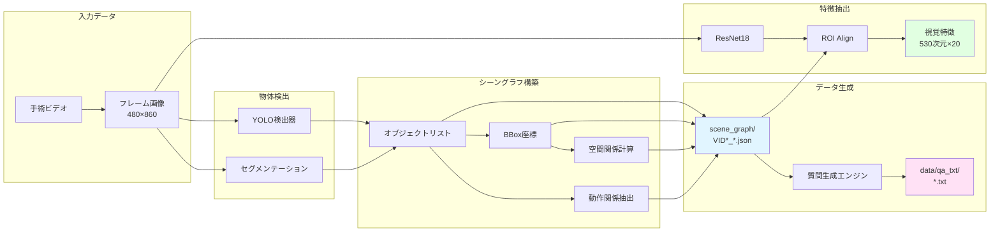

### 段階2: モデル訓練

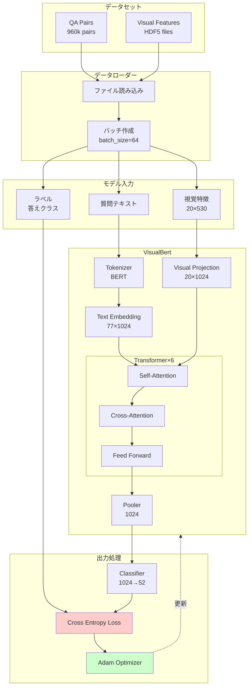

### 段階3: 推論・評価

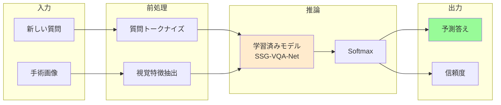

---

## クラス・データ構造

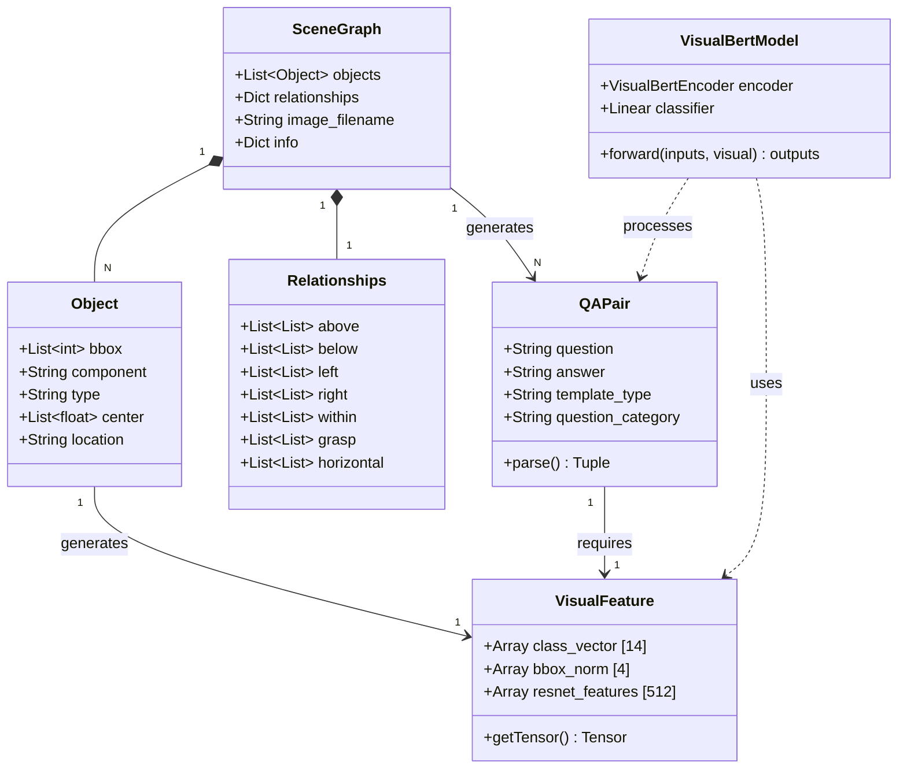

---

## シーングラフの関係性マトリクス

シーングラフの関係性は、N×N マトリクスではなく、**オブジェクトごとのリスト**として表現されます。

### 例: 6オブジェクトのシーン

| Index | Component | Type |
|-------|-----------|------|
| 0 | abdominal_wall | anatomy |
| 1 | liver | anatomy |
| 2 | gut | anatomy |
| 3 | omentum | anatomy |
| 4 | gallbladder | anatomy |
| 5 | grasper | instrument |

### Above 関係（上方向）

```
relationships['above'] = [
    [5],              # 0番は5番の上
    [5],              # 1番は5番の上
    [0,1,4,5],        # 2番は0,1,4,5番の上
    [0,1,4,5],        # 3番は0,1,4,5番の上
    [5],              # 4番は5番の上
    []                # 5番は何の上にもない
]
```

**解釈**: `relationships['above'][i]` は「iが上にあるオブジェクトのインデックスリスト」

### Grasp 関係（把持）

```
relationships['grasp'] = [
    [],  # 0番は何も把持していない
    [],  # 1番は何も把持していない
    [],  # 2番は何も把持していない
    [],  # 3番は何も把持していない
    [],  # 4番は何も把持していない
    [4]  # 5番(grasper)は4番(gallbladder)を把持
]
```

### 関係性の可視化

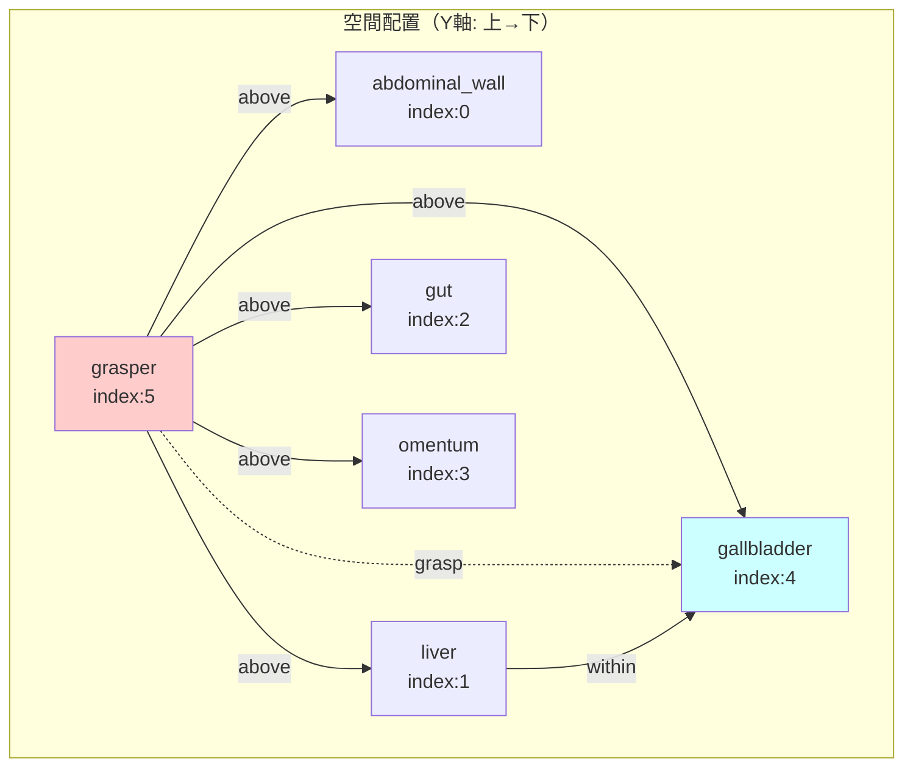

---

## 視覚特徴の構成

### ROI特徴ベクトル (530次元)

```
╔═══════════════════════════════════════════════════════════╗
║  Visual Feature Vector (530 dimensions)                  ║
╠═══════════════════════════════════════════════════════════╣
║  [0:14]   Class One-Hot Vector                           ║
║           ┌─────────────────────────────┐                ║
║           │ 14 object classes           │                ║
║           │ (anatomy + instrument)      │                ║
║           └─────────────────────────────┘                ║
╠═══════════════════════════════════════════════════════════╣
║  [14:18]  Normalized BBox Coordinates                    ║
║           ┌─────────────────────────────┐                ║
║           │ x1/860, y1/480,             │                ║
║           │ x2/860, y2/480              │                ║
║           └─────────────────────────────┘                ║
╠═══════════════════════════════════════════════════════════╣
║  [18:530] ResNet18 Visual Features                       ║
║           ┌─────────────────────────────┐                ║
║           │ 512-dim feature vector      │                ║
║           │ from ROI Align              │                ║
║           └─────────────────────────────┘                ║
╚═══════════════════════════════════════════════════════════╝
```

### 特徴抽出プロセス

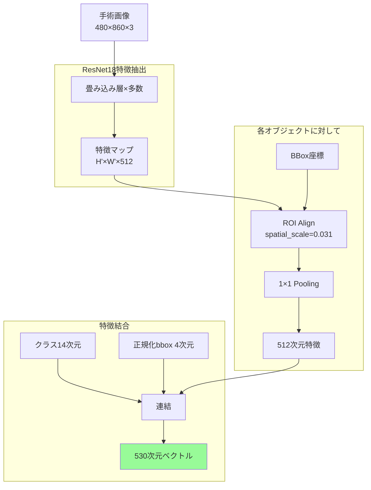

---

## 質問の複雑度レベル

### Zero-hop: 直接属性

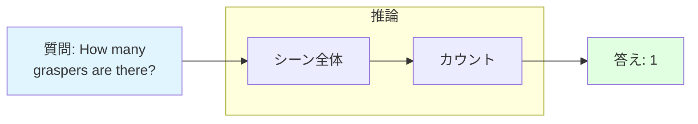

**例**:
- "How many instruments are present?"
- "What color is the liver?"
- "Is there a grasper?"

### One-hop: 1段階の関係推論

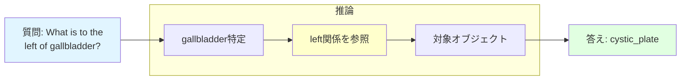

**例**:
- "What is above the liver?"
- "What color is the object to the right of X?"
- "How many instruments are grasping the gallbladder?"

### Single-and: 複数条件の同時満足

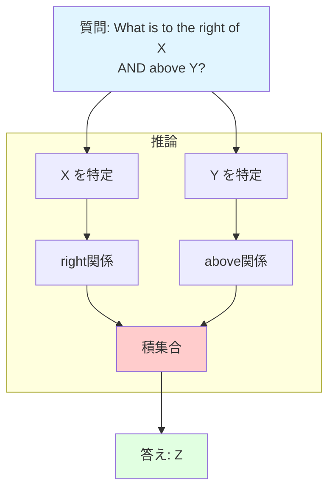

**例**:
- "How many objects are right of X and above Y?"
- "What is within X and below Y?"

### Compare: 比較・計算

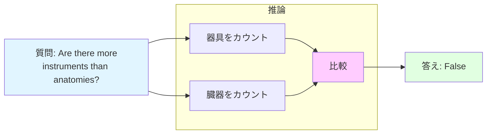

**例**:
- "Is the number of graspers greater than 2?"
- "Are there equal numbers of instruments and anatomies?"

---

## モデルアーキテクチャの詳細

### VisualBERT の構造

```
入力層
├─ テキストトークン: 77 tokens
└─ 視覚トークン: 20 objects

埋め込み層
├─ Token Embedding (語彙: 30522)
├─ Position Embedding (最大: 512)
├─ Token Type Embedding (2種類: text/visual)
└─ 埋め込みサイズ: 1024

Transformer エンコーダ × 6層
├─ Multi-Head Self-Attention (8 heads)
│  ├─ Query/Key/Value 変換
│  ├─ Attention 計算
│  └─ Concat & Linear
├─ Add & Norm
├─ Feed Forward Network
│  ├─ Linear (1024 → 4096)
│  ├─ GELU Activation
│  └─ Linear (4096 → 1024)
└─ Add & Norm

出力層
├─ Pooler (CLS token)
├─分類線形層 (1024 → 52)
└─ Softmax
```

### アテンションの流れ

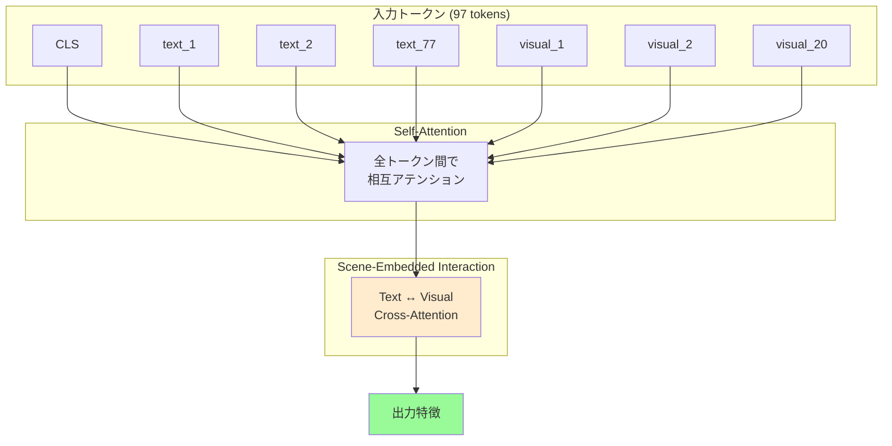

---

## 評価メトリクス

### マルチクラス分類の評価

```
Accuracy = 正しく予測したサンプル数 / 全サンプル数

Precision (適合率) = TP / (TP + FP)
各クラスで計算し、マクロ平均

Recall (再現率) = TP / (TP + FN)
各クラスで計算し、マクロ平均

F1-score = 2 × (Precision × Recall) / (Precision + Recall)
```

### 典型的な性能（論文より）

| メトリック | SSG-VQA-Net |
|----------|-------------|
| Accuracy | ~72-75% |
| mAP | ~68-71% |
| mAR | ~67-70% |
| mAF1 | ~68-70% |
| wF1 | ~71-74% |

**質問タイプ別**:
- Zero-hop: 高精度 (~80%)
- One-hop: 中精度 (~70%)
- Single-and: 向上が顕著 (~65%)
- Compare: やや低め (~60%)

---

## データセット統計の可視化

### QAペアの分布

```
質問タイプ別分布:
┌────────────────────────────────────────┐
│ Count      ████████████████  40%       │
│ Exist      ████████████      30%       │
│ Query      ████████          20%       │
│ Compare    ████              10%       │
└────────────────────────────────────────┘

複雑度別分布:
┌────────────────────────────────────────┐
│ Zero-hop   ██████████        25%       │
│ One-hop    ████████████████  40%       │
│ Single-and ████████████      30%       │
│ Compare    ██                5%        │
└────────────────────────────────────────┘

答えクラス別分布:
┌────────────────────────────────────────┐
│ Numbers    ████████          20%       │
│ Bool       ████████          20%       │
│ Anatomy    ████████████      30%       │
│ Instrument ████████          20%       │
│ Other      ████              10%       │
└────────────────────────────────────────┘
```

### ビデオ・フレーム統計

```
ビデオ数: 45 (VID01-VID80 から選択)
総フレーム数: ~25,000
総QAペア数: 960,000
ユニーク質問数: 501,000

平均値:
- QAペア/フレーム: 38.9
- オブジェクト/フレーム: 5-8
- 器具/フレーム: 1-3
- 臓器/フレーム: 3-6
```

---

## ファイルサイズと要件

### ストレージ要件

```
scene_graph/          : ~500 MB  (100,863 JSONファイル)
data/qa_txt/          : ~1.2 GB  (テキストファイル)
data/visual_feats/    : ~15 GB   (HDF5特徴ファイル)
  ├─ cropped_images/  : ~8 GB
  └─ roi_yolo_coord/  : ~7 GB
checkpoints/          : ~500 MB  (モデルチェックポイント)

合計: ~17 GB
```

### 計算要件

**訓練**:
- GPU: 8-16 GB VRAM (推奨: NVIDIA RTX 3090以上)
- RAM: 32 GB以上
- 訓練時間: ~20-30時間 (80エポック、1 GPU)

**推論**:
- GPU: 4-8 GB VRAM
- RAM: 16 GB
- 推論速度: ~50 QA/秒 (バッチサイズ32)

---

## まとめ: システムの特徴

### 革新的な点

1. **シーングラフ知識の統合**
   - 空間関係と動作関係を明示的にモデル化
   - 幾何学的推論能力の向上

2. **Scene-embedded Interaction Module (SIM)**
   - テキストと視覚のクロスモーダルアテンション
   - シーングラフの構造情報を活用

3. **多様な質問生成**
   - テンプレートベースで複雑度制御
   - 960kの大規模QAデータセット

4. **ROIベースの視覚特徴**
   - オブジェクトごとの詳細特徴
   - クラス + 位置 + 視覚情報の統合

### 応用可能性

- **手術支援システム**: リアルタイムVQA
- **手術教育**: 対話的な学習ツール
- **手術記録分析**: 自動レポート生成
- **ロボット手術**: 状況認識と意思決定

このシステムは、手術シーンの理解において、従来の画像のみのVQAを大きく超える性能を実現しています。
