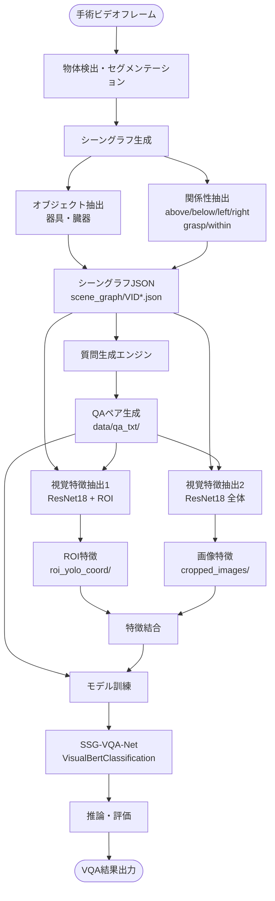
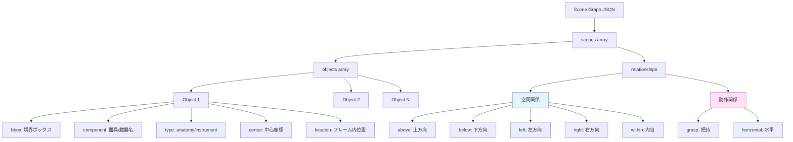
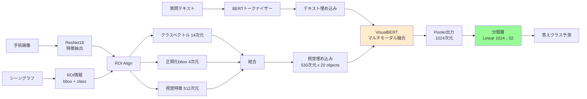

# SSG-VQA システム仕様書

## 概要

**SSG-VQA (Surgical Scene Graph - Visual Question Answering)** は、手術映像におけるシーングラフ知識を活用した視覚的質問応答システムです。器具（instruments）と臓器（anatomy）の空間的・動作的関係をグラフ構造で表現し、これを基にVQAタスクを実行します。

## システムアーキテクチャ全体像



---

## 1. データ構造

### 1.1 シーングラフ (Scene Graph)

シーングラフは手術シーン内の器具・臓器とその関係性を構造化したデータです。



#### シーングラフJSONフォーマット

**パス**: `scene_graph/VID{video_id}_{frame_id}.json`

**構造**:
```json
{
  "scenes": [{
    "objects": [
      {
        "bbox": [x1, y1, x2, y2],        // 境界ボックス座標
        "component": "gallbladder",       // 器具/臓器名
        "type": "anatomy",                // anatomy または instrument
        "center": [cx, cy],               // 中心座標
        "location": "top-mid"             // フレーム内位置
      }
    ],
    "image_filename": "VID01_0",
    "relationships": {
      "above": [[5], [5], ...],          // インデックスによる関係性表現
      "below": [[2, 3], [2, 3], ...],
      "left": [[], [0], ...],
      "right": [[1, 2, 3, 4, 5], ...],
      "grasp": [[], [], ..., [4]],       // 器具が臓器を把持
      "within": [[], [4], ...]           // 内包関係
    }
  }],
  "info": {
    "split": "new",
    "image_index": 0,
    "triplet": ["grasper,grasp,gallbladder"]  // 主要な動作トリプレット
  }
}
```

#### オブジェクトクラス

**臓器 (Anatomy)**: 14種類
- abdominal_wall_cavity, liver, gallbladder, gut, omentum
- cystic_duct, cystic_plate, cystic_artery, cystic_pedicle
- blood_vessel, peritoneum, adhesion, fluid

**器具 (Instrument)**: 8種類
- grasper, hook, clipper, scissors, irrigator, bipolar, specimenbag

#### 関係性タイプ

**空間関係**:
- `above` / `below`: 垂直方向の位置関係
- `left` / `right`: 水平方向の位置関係
- `within`: 一方が他方に内包される関係

**動作関係**:
- `grasp`: 器具が臓器を把持している
- `horizontal`: 水平な配置

---

### 1.2 質問応答ペア (QA Pairs)

**パス**: `data/qa_txt/{video_id}/{frame_id}.txt`

**フォーマット**:
```
質問文|答え|テンプレートタイプ|質問カテゴリ|追加情報
```

**例**:
```
Which anatomical structures are present?|liver, omentum, cystic_plate, gallbladder
Which tools are present?|hook
What is the action being performed on cystic_duct?|dissect
How many top-mid instruments are there?|1|zero_hop.json|count|NA
What color is the anatomy?|brown|single_and.json|query_color|NA
```

#### 質問カテゴリ

1. **Zero-hop**: シーン内のオブジェクトの直接的な属性
   - 例: "How many graspers are there?"

2. **One-hop**: 1つの関係性を経由する質問
   - 例: "What is to the left of the gallbladder?"

3. **Single-and**: 2つの関係性を同時に満たす質問
   - 例: "What is above X and to the right of Y?"

4. **Compare**: オブジェクト間の比較
   - 例: "Are there more instruments than anatomies?"

#### 質問タイプ

- **count**: 数を問う（答えは数値）
- **exist**: 存在を問う（答えはTrue/False）
- **query_component**: オブジェクト名を問う
- **query_color**: 色を問う
- **query_type**: タイプ（anatomy/instrument）を問う

---

### 1.3 視覚特徴

#### ROI特徴 (Region of Interest)

**パス**: `data/visual_feats/roi_yolo_coord/{video_id}/labels/vqa/img_features/roi/{frame_id}.hdf5`

**次元**: `(20, 530)`
- 最大20オブジェクト
- 各オブジェクト: 530次元
  - クラスベクトル: 14次元 (one-hot)
  - 正規化bbox: 4次元 (x1, y1, x2, y2)
  - ResNet18特徴: 512次元

**生成プロセス** (`utils/feature_extract_roi.py`):
1. シーングラフから各オブジェクトのbboxとクラスを取得
2. 画像をResNet18に通して特徴マップ生成
3. ROI Alignで各オブジェクト領域の特徴を抽出
4. クラスベクトル + 正規化bbox + 視覚特徴を結合

#### 全体画像特徴

**パス**: `data/visual_feats/cropped_images/{video_id}/vqa/img_features/1x1/{frame_id}.hdf5`

**次元**: `(1, 512)` または `(patch_size×patch_size, 512)`

**生成プロセス** (`utils/feat_extract_visual.py`):
1. 画像をリサイズ (480×860)
2. ResNet18で特徴抽出
3. Adaptive Average Poolingで所定サイズに
4. HDF5形式で保存

---

## 2. モデルアーキテクチャ: SSG-VQA-Net



### 2.1 VisualBertClassification

**ファイル**: `models/VisualBertClassification_ssgqa.py`

**主要コンポーネント**:

1. **テキストエンコーディング**
   - BERTトークナイザーで質問を符号化
   - 最大長: `question_len` (デフォルト: 77)
   - パディング・トランケーション適用

2. **VisualBertEncoder** (`models/VisualBert_ssgqa.py`)
   - ベース: Hugging Face VisualBERT
   - 視覚埋め込み次元: 530
   - 隠れ層サイズ: 1024
   - アテンションヘッド数: 8
   - エンコーダ層数: 6 (設定可能)

3. **Scene-embedded Interaction Module (SIM)**
   - テキストと視覚特徴間のクロスアテンション
   - シーングラフの幾何学的知識をモデルに統合

4. **分類層**
   - 線形層: 1024 → 52クラス
   - 52クラス = 答えの全候補（数値、True/False、オブジェクト名、色など）

### 2.2 データローダー

**ファイル**: `utils/dataloaderClassification.py`

**クラス**: 
- `SSGVQAClassification_full_roi_coord`: ROI座標特徴を使用
- `SSGVQAClassification_full_roi_analysis`: ROI解析特徴を使用

**処理フロー**:
1. QAテキストファイルから質問と答えを読み込み
2. 対応する視覚特徴（HDF5）を読み込み
3. 答えをクラスインデックスに変換
4. バッチ化して返す

---

## 3. 訓練・テストパイプライン

```mermaid
sequenceDiagram
    participant Data as データローダー
    participant Model as SSG-VQA-Net
    participant Opt as オプティマイザー
    participant Eval as 評価器
    
    Note over Data: train.py / test.py
    
    loop 各エポック
        Data->>Data: QAファイル読み込み
        Data->>Data: 視覚特徴読み込み<br/>(HDF5)
        
        loop 各バッチ
            Data->>Model: 質問テキスト<br/>視覚特徴
            Model->>Model: トークナイズ
            Model->>Model: VisualBERT処理
            Model->>Model: 分類
            Model-->>Opt: 損失計算
            
            alt 訓練モード
                Opt->>Model: パラメータ更新
            end
        end
        
        Model-->>Eval: 予測結果
        Eval->>Eval: 精度計算<br/>mAP, mAR, F1
    end
    
    Eval-->>Data: 最終評価メトリクス
```

### 3.1 訓練プロセス (`train.py`)

**主要ステップ**:

1. **初期化**
   ```python
   - データセット分割: train_seq, val_seq
   - モデル: VisualBertClassification
   - 損失関数: CrossEntropyLoss
   - オプティマイザ: Adam
   ```

2. **訓練ループ**
   ```python
   for epoch in range(epochs):
       for batch in train_dataloader:
           # 前向き伝播
           outputs = model(inputs, visual_features)
           loss = criterion(outputs, labels)
           
           # 逆伝播
           optimizer.zero_grad()
           loss.backward()
           optimizer.step()
       
       # 検証
       validate(val_dataloader, model)
       
       # チェックポイント保存
       if best_performance:
           save_checkpoint()
   ```

3. **評価メトリクス**
   - Accuracy
   - mAP (mean Average Precision)
   - mAR (mean Average Recall)
   - mAF1 (mean Average F1-score)
   - wF1 (weighted F1-score)

### 3.2 テストプロセス (`test.py`)

**実行方法**:
```bash
python test.py \
    --checkpoint path/to/checkpoint.pth.tar \
    --folder_head ./data/ \
    --folder_tail '/*.txt'
```

**処理**:
1. 学習済みモデルのロード
2. テストデータセットでの推論
3. 予測結果の集計
4. メトリクス計算・出力

---

## 4. 主要ファイル構成

```
SSG-VQA/
├── train.py                     # 訓練スクリプト
├── test.py                      # テストスクリプト
├── models/
│   ├── VisualBertClassification_ssgqa.py  # メインモデル
│   ├── VisualBert_ssgqa.py               # VisualBERTエンコーダ
│   └── resnets.py                         # ResNet特徴抽出器
├── utils/
│   ├── dataloaderClassification.py        # データローダー
│   ├── feat_extract_visual.py             # 画像特徴抽出
│   ├── feature_extract_roi.py             # ROI特徴抽出
│   └── utils.py                           # 汎用ユーティリティ
├── data/
│   ├── qa_txt/                   # 質問応答テキスト
│   │   └── VID*/
│   │       └── *.txt
│   └── visual_feats/              # 視覚特徴（HDF5）
│       ├── cropped_images/
│       └── roi_yolo_coord/
├── scene_graph/                  # シーングラフJSON
│   └── VID*_*.json
└── checkpoints/                  # 学習済みモデル
    └── experiment*/
        └── Best.pth.tar
```

---

## 5. シーングラフからVQAへの流れ

### 5.1 シーングラフ生成（前処理）

1. **物体検出・セグメンテーション**
   - CholecT45/CholecT50データセットの手術画像から
   - YOLOやセグメンテーションモデルで器具・臓器を検出

2. **関係性抽出**
   - 空間的位置関係: bbox座標から計算
   - 動作関係: 動作認識モデルやルールベース

3. **JSONファイル生成**
   - `scene_graph/VID{video}_{frame}.json` として保存

### 5.2 質問生成

1. **テンプレートベース生成**
   - シーングラフの構造を基にルールで質問を生成
   - 複数の質問タイプ（count, exist, query_*）
   - 複雑度レベル（zero-hop, one-hop, single-and）

2. **QAペアファイル作成**
   - `data/qa_txt/{video}/{frame}.txt` に保存
   - 1フレームあたり平均38.9個の質問

### 5.3 視覚特徴抽出

#### ROI特徴
```python
# utils/feature_extract_roi.py
1. シーングラフからbbox取得
2. ResNet18で画像全体の特徴マップ生成
3. ROI Alignで各オブジェクトの特徴抽出
4. [クラス(14) + bbox(4) + 特徴(512)] = 530次元
5. 最大20オブジェクト、パディングで調整
6. HDF5で保存
```

#### 全体画像特徴
```python
# utils/feat_extract_visual.py
1. 画像をResNet18に入力
2. Adaptive Average Poolingで1x1または4x4に
3. 512次元特徴ベクトル
4. HDF5で保存
```

### 5.4 モデル訓練

```python
# train.py
1. QAテキスト + 視覚特徴をロード
2. BERTで質問をトークナイズ
3. VisualBERTで融合
4. 分類損失で学習
5. 評価・チェックポイント保存
```

---

## 6. 重要なハイパーパラメータ

| パラメータ | デフォルト値 | 説明 |
|----------|------------|------|
| `batch_size` | 64 | バッチサイズ |
| `learning_rate` | 1e-4 | 学習率 |
| `epochs` | 80 | エポック数 |
| `question_len` | 77 | 質問の最大トークン長 |
| `num_class` | 52 | 答えのクラス数 |
| `encoder_layers` | 6 | VisualBERTの層数 |
| `n_heads` | 8 | アテンションヘッド数 |
| `hidden_size` | 1024 | 隠れ層サイズ |
| `visual_embedding_dim` | 530 | 視覚埋め込み次元 |
| `max_bbox` | 20 | 最大オブジェクト数 |

---

## 7. シーングラフの関係性表現の仕組み

### 7.1 インデックスベース表現

シーングラフの `relationships` は、オブジェクトインデックスのリストのリストです。

**例**:
```json
{
  "objects": [
    {"component": "abdominal_wall_cavity", ...},  // index 0
    {"component": "liver", ...},                  // index 1
    {"component": "gut", ...},                    // index 2
    {"component": "omentum", ...},                // index 3
    {"component": "gallbladder", ...},            // index 4
    {"component": "grasper", ...}                 // index 5
  ],
  "relationships": {
    "above": [
      [5],              // 0番 は 5番 の上にある
      [5],              // 1番 は 5番 の上にある
      [0, 1, 4, 5],     // 2番 は 0,1,4,5番 の上にある
      [0, 1, 4, 5],     // 3番 は 0,1,4,5番 の上にある
      [5],              // 4番 は 5番 の上にある
      []                // 5番 は何の上にもない
    ],
    "grasp": [
      [], [], [], [], [],
      [4]               // 5番(grasper) は 4番(gallbladder) を把持
    ]
  }
}
```

### 7.2 空間関係の計算

空間関係は主にbboxの中心座標（`center`）から計算されます:

- **above/below**: `center[1]` (y座標) を比較
- **left/right**: `center[0]` (x座標) を比較
- **within**: bbox同士の包含関係を判定

### 7.3 動作関係の判定

- **grasp**: 器具のbboxと臓器のbboxが重なり、かつ意味的に把持可能
- **horizontal**: オブジェクト間が水平に配置

---

## 8. 質問応答の推論フロー

### 8.1 推論時の処理

```python
# test.py での推論フロー
1. 質問テキストをトークナイズ
   inputs = tokenizer(question, max_length=77, ...)

2. 視覚特徴をロード
   visual_features = load_hdf5(frame_id)

3. モデルに入力
   outputs = model(inputs, visual_features)
   # outputs: (batch_size, 52)

4. 最大確率のクラスを選択
   _, predicted = torch.max(F.softmax(outputs, dim=1), 1)

5. クラスインデックスを答えに変換
   answer = labels[predicted]
```

### 8.2 答えのクラス（52種類）

```python
labels = [
    # 数値
    "0", "1", "2", "3", "4", "5", "6", "7", "8", "9", "10",
    
    # 真偽値
    "False", "True",
    
    # 臓器
    "abdominal_wall_cavity", "adhesion", "blood_vessel", 
    "cystic_artery", "cystic_duct", "cystic_pedicle", 
    "cystic_plate", "fluid", "gallbladder", "gut", 
    "liver", "omentum", "peritoneum",
    
    # 器具
    "bipolar", "clip", "clipper", "grasper", "hook", 
    "irrigator", "scissors", "specimen_bag", "specimenbag",
    
    # 動作
    "aspirate", "coagulate", "cut", "dissect", "grasp", 
    "irrigate", "pack", "retract",
    
    # 色
    "blue", "brown", "red", "silver", "white", "yellow",
    
    # タイプ
    "anatomy", "instrument"
]
```

---

## 9. 性能評価

### 9.1 評価メトリクス

**実装**: `utils/utils.py` の `eval_for_f1_et_all()`

```python
def eval_for_f1_et_all(label_true, label_pred):
    accuracy = accuracy_score(label_true, label_pred)
    
    # マルチクラス分類での precision, recall, F1
    precision = precision_score(label_true, label_pred, 
                                 average='macro', zero_division=0)
    recall = recall_score(label_true, label_pred, 
                         average='macro', zero_division=0)
    f1_macro = f1_score(label_true, label_pred, 
                       average='macro', zero_division=0)
    f1_weighted = f1_score(label_true, label_pred, 
                          average='weighted', zero_division=0)
    
    return precision, recall, f1_macro, f1_weighted, accuracy
```

### 9.2 ベンチマーク結果例

論文より（SSG-VQA-Netの性能）:
- 全体Accuracy: ~70-75%
- 複雑な質問（single-and, compare）での改善が顕著
- シーングラフ知識の統合により、幾何学的推論能力が向上

---

## 10. データセット統計

- **総QAペア数**: 960,000
- **ユニーク質問数**: 501,000
- **フレーム数**: 約25,000
- **平均質問数/フレーム**: 38.9
- **ビデオ数**: 45（CholecT45データセット）
- **シーングラフJSON数**: 100,863個以上

---

## 11. 実行例

### 訓練
```bash
python train.py \
    --batch_size 64 \
    --epochs 80 \
    --lr 0.0001 \
    --encoder_layer 6 \
    --n_heads 8 \
    --folder_head ./data/ \
    --folder_tail '/*.txt'
```

### テスト
```bash
python test.py \
    --checkpoint ./checkpoints/experiment1/Best.pth.tar \
    --folder_head ./data/ \
    --folder_tail '/*.txt'
```

### 視覚特徴抽出
```bash
# ROI特徴
python utils/feature_extract_roi.py

# 画像全体特徴
python utils/feat_extract_visual.py --patch_size 1
```

---

## 12. まとめ

SSG-VQAシステムは以下の要素で構成されます:

1. **シーングラフ**: 器具・臓器とその関係性の構造化表現
2. **質問生成**: シーングラフから自動生成されたQAペア
3. **視覚特徴**: ResNet18ベースのROI特徴抽出
4. **モデル**: VisualBERTベースのマルチモーダル融合
5. **訓練・評価**: マルチクラス分類タスクとして実行

**核心的な革新**:
- シーングラフによる幾何学的知識のモデルへの統合
- Scene-embedded Interaction Module (SIM) によるクロスモーダルアテンション
- テンプレートベースの多様な質問生成（複雑度・タイプの制御）

これにより、従来のVQAシステムよりも空間的推論能力が大幅に向上しています。
