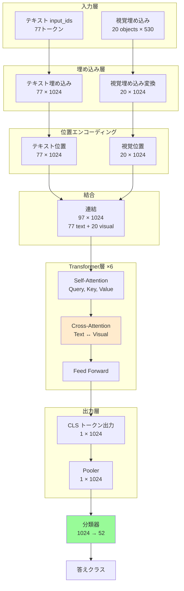

# SSG-VQA 実装詳細と具体例

## 目次
1. [シーングラフの具体例](#1-シーングラフの具体例)
2. [質問生成の実例](#2-質問生成の実例)
3. [視覚特徴抽出の詳細](#3-視覚特徴抽出の詳細)
4. [モデル推論の流れ](#4-モデル推論の流れ)
5. [コードウォークスルー](#5-コードウォークスルー)

---

## 1. シーングラフの具体例

### 実際のシーングラフデータ (VID01_0.json)

```json
{
    "scenes": [
        {
            "objects": [
                {
                    "bbox": [20, 0, 166, 239],
                    "component": "abdominal_wall_cavity",
                    "type": "anatomy",
                    "center": [93.0, 119.5],
                    "location": "top-left"
                },
                {
                    "bbox": [88, 0, 399, 239],
                    "component": "liver",
                    "type": "anatomy",
                    "center": [243.5, 119.5],
                    "location": "top-mid"
                },
                {
                    "bbox": [290, 234, 367, 239],
                    "component": "gut",
                    "type": "anatomy",
                    "center": [328.5, 236.5],
                    "location": "bottom-right"
                },
                {
                    "bbox": [278, 168, 388, 235],
                    "component": "omentum",
                    "type": "anatomy",
                    "center": [333.0, 201.5],
                    "location": "bottom-right"
                },
                {
                    "bbox": [153, 9, 289, 220],
                    "component": "gallbladder",
                    "type": "anatomy",
                    "center": [221.0, 114.5],
                    "location": "top-mid"
                },
                {
                    "bbox": [198, 3, 279, 37],
                    "component": "grasper",
                    "type": "instrument",
                    "center": [238.5, 20.0],
                    "location": "top-mid"
                }
            ],
            "image_filename": "VID01_0",
            "relationships": {
                "above": [
                    [5],                    // object 0 (abdominal_wall) は object 5 (grasper) の上
                    [5],                    // object 1 (liver) は object 5 (grasper) の上
                    [0, 1, 4, 5],          // object 2 (gut) は objects 0,1,4,5 の上
                    [0, 1, 4, 5],          // object 3 (omentum) は objects 0,1,4,5 の上
                    [5],                    // object 4 (gallbladder) は object 5 (grasper) の上
                    []                      // object 5 (grasper) は何の上にもない
                ],
                "below": [
                    [2, 3],                 // object 0 は objects 2,3 の下
                    [2, 3],
                    [],
                    [],
                    [2, 3],
                    [0, 1, 2, 3, 4]        // grasper は全ての臓器の下
                ],
                "grasp": [
                    [], [], [], [], [],
                    [4]                     // grasper が gallbladder を把持
                ],
                "left": [
                    [],
                    [0],                    // liver は abdominal_wall の左
                    [0, 1, 4, 5],
                    [0, 1, 4, 5],
                    [0],
                    [0]
                ],
                "right": [
                    [1, 2, 3, 4, 5],       // abdominal_wall は他の全てオブジェクトの右
                    [2, 3],
                    [],
                    [],
                    [2, 3],
                    [2, 3]
                ],
                "within": [
                    [],
                    [4],                    // liver は gallbladder を内包
                    [1, 3],                 // gut は liver と omentum に内包される
                    [1],                    // omentum は liver に内包される
                    [],
                    [1, 4]                  // grasper は liver と gallbladder に関与
                ]
            }
        }
    ],
    "info": {
        "split": "new",
        "image_index": 0,
        "image_filename": ["VID01_0"],
        "triplet": ["grasper,grasp,gallbladder"]
    }
}
```

### シーン解釈

このシーンでは:
1. **臓器5つ**: abdominal_wall, liver, gut, omentum, gallbladder
2. **器具1つ**: grasper
3. **主要動作**: grasper が gallbladder を把持している
4. **空間配置**: 
   - grasper は最も下（手術者の視点）
   - liver が中央付近に広く存在
   - gallbladder が liver 内に
   - gut と omentum が右下に

---

## 2. 質問生成の実例

### VID01/262.txt の実際のQAペア

```
Which anatomical structures are present?|liver, omentum, cystic_plate, gallbladder
Which tools are present?|hook
What is the action being performed on cystic_duct?|dissect
Which target is being dissected in the scene?|cystic_duct
What anatomy is at the top-mid of the frame ?|cystic_plate|[157.0, 60.0]
What anatomy is at the bottom-mid of the frame ?|gallbladder|[203.5, 207.0]
What number of objects are to the right of the red top-mid cystic_plate thing and above the brown bottom-mid thing?|1|single_and.json|count|NA
How many top-mid anatomys are to the right of the red top-mid cystic_plate thing and above the brown bottom-mid thing?|0|single_and.json|count|NA
There is a anatomy that is within the white hook instrument and within the gallbladder object?; what name is it?|omentum|single_and.json|query_component|NA
What color is the anatomy that is both to the right of the red top-mid object and within the white top-mid hook instrument?|yellow|single_and.json|query_color|NA
How many top-mid instruments are there?|1|zero_hop.json|count|NA
What number of hook objects are below the brown anatomy?|0|one_hop.json|count|relate_spatial
There is a brown anatomy; how many omentum anatomys are within it?|1|one_hop.json|count|relate_spatial
There is a top-mid hook instrument; are there any top-mid hook objects within it?|False|one_hop.json|exist|relate_spatial
Are there any top-mid things left of the top-mid hook instrument?|True|one_hop.json|exist|relate_spatial
The bottom-mid anatomy that is below the brown anatomy is what color?|white|one_hop.json|query_color|relate_spatial
The object to the left of the brown anatomy is what color?|red|one_hop.json|query_color|relate_spatial
The object above the yellow top-mid thing is what type?|anatomy|one_hop.json|query_type|relate_spatial
What type is the white thing that is above the bottom-mid liver anatomy?|instrument|one_hop.json|query_type|relate_spatial
There is a white object below the yellow omentum object; what is it?|gallbladder|one_hop.json|query_component|relate_spatial
There is a anatomy that is on the left side of the yellow omentum thing; what is it?|cystic_plate|one_hop.json|query_component|relate_spatial
```

### 質問タイプ別の分類

#### Zero-hop 質問（直接的な属性）
```
Q: How many top-mid instruments are there?
A: 1
   
解釈: シーン全体を見て、top-mid位置の器具を数える
関係性: 不要
```

#### One-hop 質問（1段階の関係推論）
```
Q: The object to the left of the brown anatomy is what color?
A: red

解釈: 
1. brown anatomy を特定 (例: gallbladder)
2. その左にあるオブジェクトを探す (例: cystic_plate)
3. その色を答える (red)

関係性: left (1段階)
```

#### Single-and 質問（複数条件の同時満足）
```
Q: What number of objects are to the right of the red top-mid cystic_plate thing 
   and above the brown bottom-mid thing?
A: 1

解釈:
1. red top-mid cystic_plate を特定
2. brown bottom-mid thing を特定
3. 条件1: cystic_plate の右にある
4. 条件2: brown thing の上にある
5. 両条件を満たすオブジェクトを数える

関係性: right AND above (2段階、論理積)
```

#### Compare 質問（比較）
```
Q: Are there more instruments than anatomies?
A: False

解釈:
1. 器具の数を数える
2. 臓器の数を数える
3. 比較する
```

---

## 3. 視覚特徴抽出の詳細

### 3.1 ROI特徴抽出の実装

```python
# utils/feature_extract_roi.py の動作

class FeatureExtractor(nn.Module):
    def __init__(self):
        super(FeatureExtractor, self).__init__()
        # ResNet18 (最後の2層を除く)
        self.img_feature_extractor = models.resnet18(pretrained=True)
        self.img_feature_extractor = torch.nn.Sequential(
            *(list(self.img_feature_extractor.children())[:-2])
        )
        self.max_bbox = 20

    def forward(self, img, boxes, classes):
        # 入力画像: (1, 3, 480, 860)
        # boxes: リスト of bboxes
        # classes: (N, 14) one-hot ベクトル
        
        if len(boxes[0]) == 0:
            # オブジェクトがない場合はゼロパディング
            return torch.zeros((self.max_bbox, 530)).cuda()

        # 画像全体の特徴マップ抽出
        outputs = self.img_feature_extractor(img)
        # outputs shape: (1, 512, H', W')
        
        # ROI Align: 各bboxの特徴を抽出
        outputs = roi_align(outputs, boxes, 
                           spatial_scale=0.031,  # 元画像とfeature mapのスケール比
                           output_size=1)        # 1x1に
        outputs = outputs.squeeze(-1).squeeze(-1)
        # outputs shape: (N, 512)
        
        # bbox座標を正規化 (画像サイズ: 860x480)
        boxes_norm = torch.FloatTensor(
            [[i[0]/860, i[1]/480, i[2]/860, i[3]/480] for i in boxes[0]]
        ).cuda()
        # boxes_norm shape: (N, 4)
        
        # クラス + bbox + 視覚特徴を結合
        outputs = torch.cat([classes, boxes_norm, outputs], 1)
        # outputs shape: (N, 14+4+512=530)
        
        # 20オブジェクトに満たない場合はパディング
        padd_outputs = torch.zeros((self.max_bbox - len(outputs), 530)).cuda()
        final_outputs = torch.cat([outputs, padd_outputs])
        # final_outputs shape: (20, 530)
        
        return final_outputs
```

### 3.2 特徴ベクトルの詳細構成

```
[ 530次元ベクトル ]
├── [0:14]     クラスベクトル (one-hot)
│   ├── 0: cystic_plate
│   ├── 1: gallbladder
│   ├── 2: abdominal_wall_cavity
│   ├── 3: omentum
│   ├── 4: liver
│   ├── 5: cystic_duct
│   ├── 6: gut
│   ├── 7: bipolar
│   ├── 8: clipper
│   ├── 9: grasper
│   ├── 10: hook
│   ├── 11: irrigator
│   ├── 12: scissors
│   └── 13: specimenbag
│
├── [14:18]    正規化bbox座標
│   ├── 14: x1 / 860
│   ├── 15: y1 / 480
│   ├── 16: x2 / 860
│   └── 17: y2 / 480
│
└── [18:530]   ResNet18視覚特徴 (512次元)
```

**例**: grasper オブジェクト
```python
feature_vector = [
    0, 0, 0, 0, 0, 0, 0, 0, 0, 1, 0, 0, 0, 0,  # one-hot: grasper
    0.230, 0.006, 0.324, 0.077,                # 正規化bbox
    0.023, ..., 0.145                           # 512次元の視覚特徴
]
```

---

## 4. モデル推論の流れ

### 4.1 前処理

```python
# test.py の処理

# 質問: "What is the action being performed on cystic_duct?"
question = "What is the action being performed on cystic_duct?"

# BERTトークナイザーで符号化
from transformers import BertTokenizer
tokenizer = BertTokenizer.from_pretrained('bert-base-uncased')

inputs = tokenizer(
    question,
    return_tensors="pt",
    padding="max_length",
    truncation=True,
    max_length=77
)

# inputs の内容:
# {
#   'input_ids': tensor([[101, 2054, 2003, 1996, 2895, ..., 0, 0, 0]]),
#   'token_type_ids': tensor([[0, 0, 0, ..., 0]]),
#   'attention_mask': tensor([[1, 1, 1, ..., 0, 0, 0]])
# }
```

### 4.2 視覚特徴のロード

```python
# VID01の262フレームの視覚特徴
visual_feature_path = "data/visual_feats/roi_yolo_coord/VID01/labels/vqa/img_features/roi/000262.hdf5"

import h5py
frame_data = h5py.File(visual_feature_path, 'r')
visual_features = torch.from_numpy(frame_data['visual_features'][:])
# visual_features shape: (20, 530)

# 画像全体特徴も結合される場合
img_feature_path = "data/visual_feats/cropped_images/VID01/vqa/img_features/1x1/000262.hdf5"
frame_data_pix = h5py.File(img_feature_path, 'r')
visual_features_pix = torch.from_numpy(frame_data_pix['visual_features'][:])
# visual_features_pix shape: (1, 512)

# ROI特徴に画像特徴を追加
visual_features[:, 18:] = visual_features_pix
```

### 4.3 モデル推論

```python
# models/VisualBertClassification_ssgqa.py

class VisualBertClassification(nn.Module):
    def forward(self, inputs, visual_embeds):
        # 視覚トークンの準備
        visual_token_type_ids = torch.ones(visual_embeds.shape[:-1], dtype=torch.long).to(device)
        visual_attention_mask = torch.ones(visual_embeds.shape[:-1], dtype=torch.float).to(device)
        
        # 入力に視覚特徴を追加
        inputs.update({
            'visual_embeds': visual_embeds,
            'output_attentions': True
        })
        
        # VisualBERTエンコーダ
        outputs = self.VisualBertEncoder(**inputs)
        # outputs['pooler_output'] shape: (batch_size, 1024)
        
        # 分類層
        outputs = self.classifier(outputs['pooler_output'])
        # outputs shape: (batch_size, 52)
        
        return outputs

# 実行
model = VisualBertClassification(vocab_size=30522, layers=6, n_heads=8, num_class=52)
outputs = model(inputs, visual_features)
# outputs: (1, 52) の確率分布

# 最大確率のクラスを選択
scores, predicted = torch.max(F.softmax(outputs, dim=1).data, 1)
# predicted: tensor([29])  → インデックス29

# クラスインデックスを答えに変換
labels = ["0", "1", "2", ..., "dissect", ..., "True"]
answer = labels[predicted]
# answer: "dissect"
```

### 4.4 VisualBERTの内部動作



---

## 5. コードウォークスルー

### 5.1 訓練の主要ループ (train.py)

```python
def train(args, train_dataloader, model, criterion, optimizer, epoch, tokenizer, device):
    model.train()
    
    total_loss = 0.0
    label_true = None
    label_pred = None
    
    for i, (_, visual_features, q, labels) in enumerate(train_dataloader, 0):
        # ステップ1: 質問をトークナイズ
        questions = []
        for question in q:
            questions.append(question)
        
        inputs = tokenizer(
            questions,
            return_tensors="pt",
            padding="max_length",
            truncation=True,
            max_length=args.question_len
        )
        
        # ステップ2: データを GPU に
        visual_features = visual_features.to(device)
        labels = labels.to(device)
        
        # ステップ3: 前向き伝播
        outputs = model(inputs, visual_features)
        
        # ステップ4: 損失計算
        loss = criterion(outputs, labels)  # CrossEntropyLoss
        
        # ステップ5: 逆伝播
        optimizer.zero_grad()
        loss.backward()
        optimizer.step()
        
        # ステップ6: 統計収集
        total_loss += loss.item()
        scores, predicted = torch.max(F.softmax(outputs, dim=1).data, 1)
        
        label_true = labels.data.cpu() if label_true == None else torch.cat((label_true, labels.data.cpu()), 0)
        label_pred = predicted.data.cpu() if label_pred == None else torch.cat((label_pred, predicted.data.cpu()), 0)
    
    # ステップ7: エポック終了時の評価
    mAP, mAR, mAf1, wf1, acc = eval_for_f1_et_all(label_true, label_pred)
    
    print(f'Epoch: {epoch} | Loss: {total_loss:.4f} | Acc: {acc:.4f} | F1: {mAf1:.4f}')
    
    return acc, mAf1
```

### 5.2 データローダーの動作 (utils/dataloaderClassification.py)

```python
class SSGVQAClassification_full_roi_coord(Dataset):
    def __init__(self, seq, folder_head, folder_tail, patch_size=4):
        self.folder_head = folder_head
        
        # ステップ1: QAファイルを収集
        filenames = []
        for curr_seq in seq:
            filenames = filenames + glob.glob(
                folder_head + "qa_txt/" + str(curr_seq) + folder_tail
            )
        
        # ステップ2: 各ファイルからQAペアを抽出
        self.vqas = []
        for file in filenames:
            file_data = open(file, 'r')
            lines = [line.strip('\n') for line in file_data if line != '\n']
            file_data.close()
            
            for idx, line in enumerate(lines):
                if idx >= 2:  # 最初の2行はヘッダー
                    self.vqas.append([file, line])
        
        # ステップ3: 答えのラベル定義
        self.labels = ["0", "1", "2", ..., "True", "abdominal_wall_cavity", ...]
    
    def __getitem__(self, idx):
        # ステップ1: ファイル情報取得
        vid = self.vqas[idx][0].split('/')[3]  # VID01
        fid = self.vqas[idx][0].split('/')[-1]  # 262.txt
        
        # ステップ2: ROI視覚特徴をロード
        visual_feature_loc = os.path.join(
            self.folder_head, "visual_feats", "roi_yolo_coord",
            vid, "labels", "vqa", "img_features", "roi",
            "%06d" % int(fid.split('.txt')[0]) + ".hdf5"
        )
        frame_data = h5py.File(visual_feature_loc, 'r')
        visual_features = torch.from_numpy(frame_data['visual_features'][:])
        
        # ステップ3: 画像全体特徴をロード
        visual_feature_pix = os.path.join(
            self.folder_head, "visual_feats", "cropped_images",
            vid, "vqa", "img_features", "1x1",
            "%06d" % int(fid.split('.txt')[0]) + ".hdf5"
        )
        frame_data_pix = h5py.File(visual_feature_pix, 'r')
        visual_features_pix = torch.from_numpy(frame_data_pix['visual_features'][:])
        
        # ステップ4: 特徴を結合
        visual_features[:, 18:] = visual_features_pix
        
        # ステップ5: 質問と答えを取得
        question = self.vqas[idx][1].split('|')[0]
        answer_text = self.vqas[idx][1].split('|')[1]
        label = self.labels.index(str(answer_text))
        
        return "", visual_features, question, label
```

### 5.3 評価関数 (utils/utils.py)

```python
from sklearn.metrics import accuracy_score, precision_score, recall_score, f1_score

def eval_for_f1_et_all(label_true, label_pred):
    """
    マルチクラス分類の評価メトリクスを計算
    
    Args:
        label_true: 正解ラベル (tensor or numpy array)
        label_pred: 予測ラベル (tensor or numpy array)
    
    Returns:
        mAP: mean Average Precision (macro)
        mAR: mean Average Recall (macro)
        mAf1: mean Average F1-score (macro)
        wf1: weighted F1-score
        acc: Accuracy
    """
    
    # 精度（Accuracy）: 正答率
    acc = accuracy_score(label_true, label_pred)
    
    # Precision（適合率）: 予測が正しい割合
    # macro: 各クラスの平均
    mAP = precision_score(
        label_true, label_pred,
        average='macro',
        zero_division=0
    )
    
    # Recall（再現率）: 正解を予測できた割合
    mAR = recall_score(
        label_true, label_pred,
        average='macro',
        zero_division=0
    )
    
    # F1-score: Precision と Recall の調和平均
    # macro: 各クラスを均等に重視
    mAf1 = f1_score(
        label_true, label_pred,
        average='macro',
        zero_division=0
    )
    
    # weighted: サンプル数でクラスを重み付け
    wf1 = f1_score(
        label_true, label_pred,
        average='weighted',
        zero_division=0
    )
    
    return mAP, mAR, mAf1, wf1, acc
```

---

## 6. よくある処理のパターン

### 6.1 シーングラフからの関係性クエリ

```python
import json

# シーングラフの読み込み
with open('scene_graph/VID01_0.json', 'r') as f:
    scene_graph = json.load(f)

scene = scene_graph['scenes'][0]
objects = scene['objects']
relationships = scene['relationships']

# 質問: "grasper は何を把持しているか?"
def find_grasped_objects(component_name):
    # grasper のインデックスを探す
    grasper_idx = None
    for idx, obj in enumerate(objects):
        if obj['component'] == component_name:
            grasper_idx = idx
            break
    
    if grasper_idx is None:
        return []
    
    # grasp 関係を確認
    grasped_indices = relationships['grasp'][grasper_idx]
    
    # インデックスからオブジェクト名を取得
    grasped_objects = [objects[i]['component'] for i in grasped_indices]
    
    return grasped_objects

result = find_grasped_objects('grasper')
print(result)  # ['gallbladder']
```

### 6.2 空間関係のクエリ

```python
def find_objects_above(target_component):
    """target_component の上にあるオブジェクトを探す"""
    
    # ターゲットのインデックス
    target_idx = None
    for idx, obj in enumerate(objects):
        if obj['component'] == target_component:
            target_idx = idx
            break
    
    if target_idx is None:
        return []
    
    # 全オブジェクトをチェック: relationships['above'][i] に target_idx が含まれるか
    above_objects = []
    for idx, obj in enumerate(objects):
        if target_idx in relationships['above'][idx]:
            above_objects.append(obj['component'])
    
    return above_objects

result = find_objects_above('grasper')
print(result)  # ['abdominal_wall_cavity', 'liver', 'gut', 'omentum', 'gallbladder']
```

### 6.3 複合条件のクエリ

```python
def find_objects_satisfying_multiple_conditions(conditions):
    """
    複数の空間条件を同時に満たすオブジェクトを探す
    
    conditions: [
        ('right', 'cystic_plate'),  # cystic_plate の右
        ('above', 'gallbladder')     # gallbladder の上
    ]
    """
    
    # 各条件を満たすオブジェクトのインデックスを取得
    satisfying_sets = []
    
    for relation, reference_component in conditions:
        # reference のインデックス
        ref_idx = None
        for idx, obj in enumerate(objects):
            if obj['component'] == reference_component:
                ref_idx = idx
                break
        
        if ref_idx is None:
            continue
        
        # この条件を満たすオブジェクト
        satisfying = set()
        for idx, obj in enumerate(objects):
            if ref_idx in relationships[relation][idx]:
                satisfying.add(idx)
        
        satisfying_sets.append(satisfying)
    
    # 全条件を満たすオブジェクト（積集合）
    if satisfying_sets:
        final_indices = set.intersection(*satisfying_sets)
        return [objects[i]['component'] for i in final_indices]
    
    return []

conditions = [('right', 'cystic_plate'), ('above', 'gallbladder')]
result = find_objects_satisfying_multiple_conditions(conditions)
print(result)  # 両条件を満たすオブジェクト名
```

---

## 7. デバッグのヒント

### 7.1 視覚特徴の確認

```python
import h5py
import numpy as np

# HDF5ファイルの内容を確認
file_path = "data/visual_feats/roi_yolo_coord/VID01/labels/vqa/img_features/roi/000262.hdf5"
with h5py.File(file_path, 'r') as f:
    print("Keys:", list(f.keys()))
    features = f['visual_features'][:]
    print("Shape:", features.shape)  # (20, 530)
    print("Non-zero objects:", np.sum(np.any(features != 0, axis=1)))
    
    # 各オブジェクトのクラス（最初の14次元）
    for i in range(20):
        class_vec = features[i, :14]
        if np.sum(class_vec) > 0:
            class_idx = np.argmax(class_vec)
            print(f"Object {i}: class {class_idx}, bbox: {features[i, 14:18]}")
```

### 7.2 モデルの注意機構の可視化

```python
# VisualBertClassification で output_attentions=True を設定
inputs.update({
    'visual_embeds': visual_embeds,
    'output_attentions': True
})

outputs = model.VisualBertEncoder(**inputs)

# アテンションウェイトを取得
attentions = outputs['attentions']  # tuple of (batch_size, num_heads, seq_len, seq_len)

# 最終層のアテンションを可視化
last_layer_attention = attentions[-1][0]  # (num_heads, seq_len, seq_len)
print("Attention shape:", last_layer_attention.shape)

# テキストトークンから視覚トークンへのアテンション
text_to_visual = last_layer_attention[:, :77, 77:97]  # (num_heads, 77, 20)
print("Max attention to visual:", text_to_visual.max(dim=-1))
```

### 7.3 予測の詳細確認

```python
# test.py での詳細な予測結果
with torch.no_grad():
    outputs = model(inputs, visual_features)
    probs = F.softmax(outputs, dim=1)
    
    # 上位5つの予測
    top5_probs, top5_indices = torch.topk(probs, 5, dim=1)
    
    for i, (prob, idx) in enumerate(zip(top5_probs[0], top5_indices[0])):
        print(f"Rank {i+1}: {labels[idx]} (prob: {prob:.4f})")

# 出力例:
# Rank 1: dissect (prob: 0.8523)
# Rank 2: grasp (prob: 0.0821)
# Rank 3: cut (prob: 0.0342)
# Rank 4: retract (prob: 0.0156)
# Rank 5: coagulate (prob: 0.0098)
```

---

## まとめ

このドキュメントでは、SSG-VQAシステムの実装詳細を具体例とともに説明しました:

1. **シーングラフ**: JSON構造とインデックスベースの関係性表現
2. **質問生成**: テンプレートベースの多様なQAペア生成
3. **視覚特徴**: ROI Alignによる530次元特徴ベクトル
4. **モデル**: VisualBERTのマルチモーダル融合
5. **コード**: 訓練・テスト・評価の実装詳細

これらの要素が統合され、手術シーンにおける高度な視覚的質問応答を実現しています。
