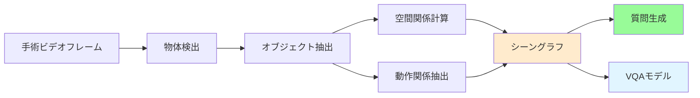
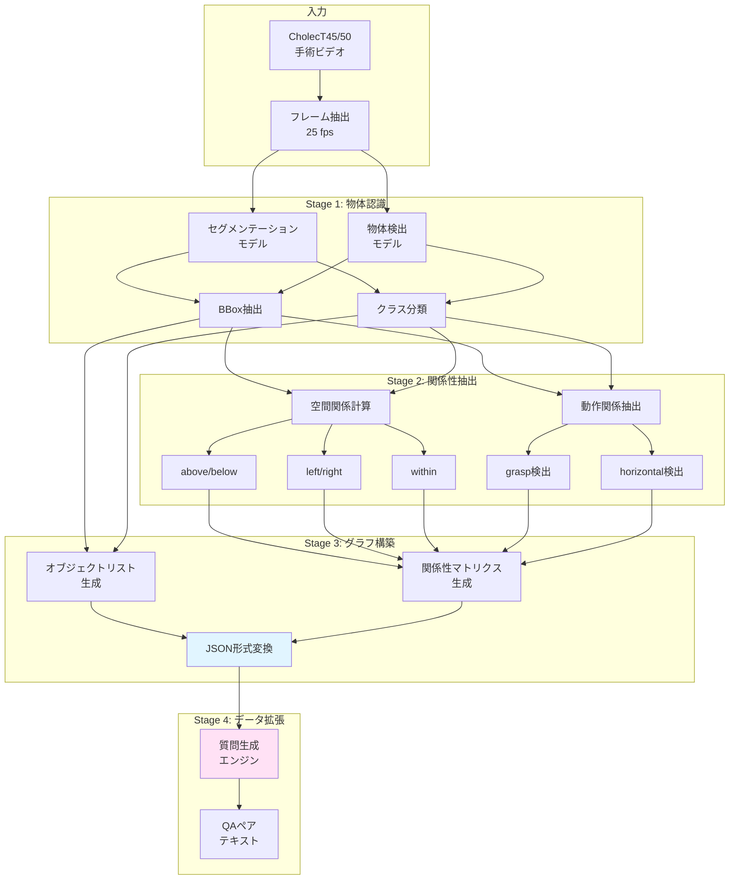
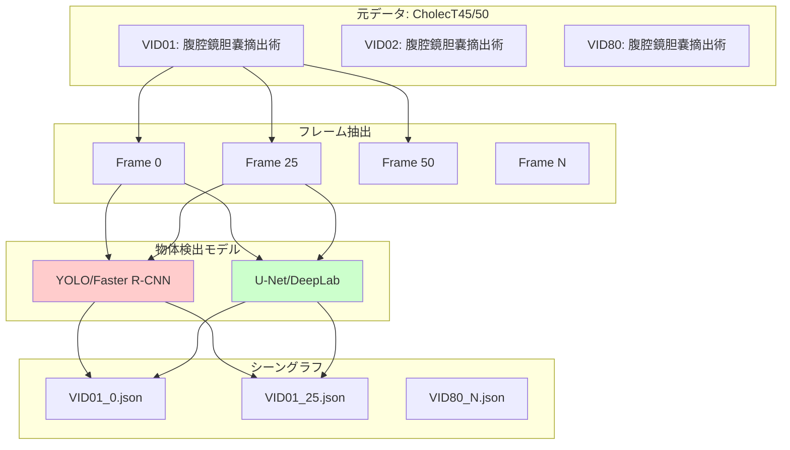
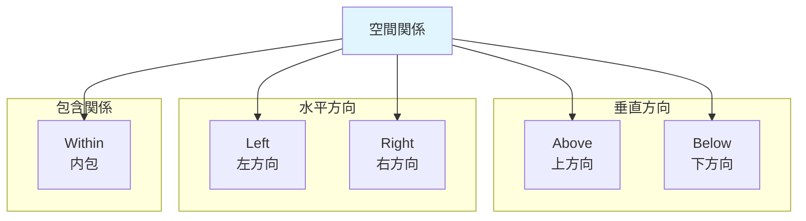
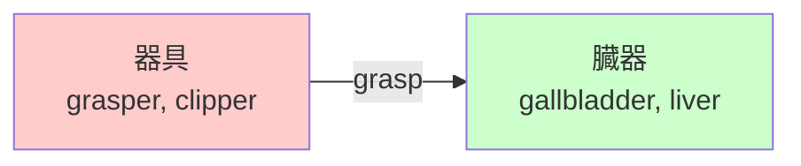
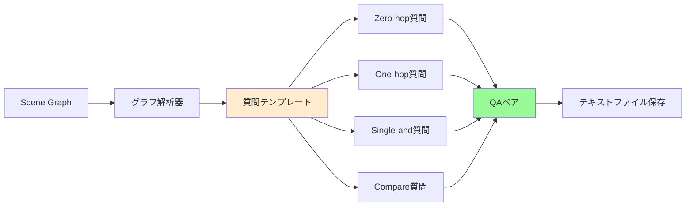

# 手術シーングラフ（知識グラフ）生成プロセス詳細

## 目次
1. [概要](#1-概要)
2. [全体アーキテクチャ](#2-全体アーキテクチャ)
3. [ステップ1: 物体検出・セグメンテーション](#3-ステップ1-物体検出セグメンテーション)
4. [ステップ2: 空間関係の抽出](#4-ステップ2-空間関係の抽出)
5. [ステップ3: 動作関係の抽出](#5-ステップ3-動作関係の抽出)
6. [ステップ4: シーングラフJSON生成](#6-ステップ4-シーングラフjson生成)
7. [ステップ5: 質問生成エンジン](#7-ステップ5-質問生成エンジン)
8. [実装の詳細と設計判断](#8-実装の詳細と設計判断)

---

## 1. 概要

SSG-VQAにおける**シーングラフ**は、手術ビデオの各フレームにおける器具（instruments）と臓器（anatomy）の空間的・動作的関係を構造化した知識グラフです。

### 1.1 シーングラフの役割



### 1.2 生成されるデータ統計

| 項目 | 数値 |
|------|------|
| シーングラフJSON数 | 100,863 |
| 元データセット | CholecT45/CholecT50 |
| 平均オブジェクト数/フレーム | 5-8個 |
| 関係性タイプ | 7種類 |
| オブジェクトクラス | 22種類（14臓器 + 8器具） |

---

## 2. 全体アーキテクチャ

### 2.1 シーングラフ生成パイプライン



### 2.2 データフロー図



---

## 3. ステップ1: 物体検出・セグメンテーション

### 3.1 使用モデル

シーングラフ生成には、以下のようなモデルが使用されると想定されます（論文より）:

#### 物体検出モデル
- **YOLO (You Only Look Once)**: リアルタイム物体検出
- **Faster R-CNN**: 高精度物体検出
- **用途**: 器具と臓器の境界ボックス検出

#### セグメンテーションモデル
- **U-Net**: 医療画像セグメンテーション
- **DeepLabV3+**: セマンティックセグメンテーション
- **用途**: ピクセルレベルの臓器・器具領域分割

### 3.2 検出対象クラス

#### 臓器（Anatomy）: 14クラス

| ID | クラス名 | 説明 |
|----|---------|------|
| 0 | cystic_plate | 胆嚢床 |
| 1 | gallbladder | 胆嚢 |
| 2 | abdominal_wall_cavity | 腹壁・腹腔 |
| 3 | omentum | 大網 |
| 4 | liver | 肝臓 |
| 5 | cystic_duct | 胆嚢管 |
| 6 | gut | 腸管 |
| - | cystic_artery | 胆嚢動脈 |
| - | cystic_pedicle | 胆嚢茎 |
| - | blood_vessel | 血管 |
| - | peritoneum | 腹膜 |
| - | adhesion | 癒着 |
| - | fluid | 体液 |

#### 器具（Instrument）: 8クラス

| ID | クラス名 | 説明 |
|----|---------|------|
| 7 | bipolar | バイポーラ（凝固器具） |
| 8 | clipper | クリッパー（クリップ器具） |
| 9 | grasper | グラスパー（把持鉗子） |
| 10 | hook | フック（フック型電気メス） |
| 11 | irrigator | 吸引洗浄器 |
| 12 | scissors | 剪刀 |
| 13 | specimenbag | 検体回収袋 |

### 3.3 検出プロセス

```python
# 疑似コード: 物体検出プロセス

def detect_objects(frame_image):
    """
    フレーム画像から器具と臓器を検出
    
    Args:
        frame_image: numpy array (H, W, 3)
    
    Returns:
        detected_objects: List[dict]
    """
    # ステップ1: 前処理
    resized_image = resize(frame_image, (480, 860))
    normalized_image = normalize(resized_image)
    
    # ステップ2: 物体検出モデルで検出
    detections = yolo_model.detect(normalized_image)
    # detections: [
    #   {'bbox': [x1, y1, x2, y2], 'class': 'liver', 'confidence': 0.95},
    #   {'bbox': [x1, y1, x2, y2], 'class': 'grasper', 'confidence': 0.92},
    #   ...
    # ]
    
    # ステップ3: セグメンテーションで精密化
    segmentation_masks = unet_model.segment(normalized_image)
    
    # ステップ4: 統合
    detected_objects = []
    for det in detections:
        if det['confidence'] > threshold:
            # セグメンテーションマスクでbboxを精密化
            refined_bbox = refine_bbox(det['bbox'], segmentation_masks)
            
            obj = {
                'bbox': refined_bbox,
                'component': det['class'],
                'type': 'anatomy' if det['class'] in anatomy_classes else 'instrument',
                'confidence': det['confidence']
            }
            detected_objects.append(obj)
    
    return detected_objects
```

### 3.4 位置情報の計算

```python
def compute_object_locations(detected_objects, image_size=(480, 860)):
    """
    オブジェクトの中心座標とフレーム内位置を計算
    
    Args:
        detected_objects: List[dict]
        image_size: (height, width)
    
    Returns:
        objects_with_locations: List[dict]
    """
    height, width = image_size
    
    for obj in detected_objects:
        x1, y1, x2, y2 = obj['bbox']
        
        # 中心座標
        center_x = (x1 + x2) / 2.0
        center_y = (y1 + y2) / 2.0
        obj['center'] = [center_x, center_y]
        
        # フレーム内位置（9分割グリッド）
        # top, mid, bottom × left, mid, right
        vertical = 'top' if center_y < height/3 else ('mid' if center_y < 2*height/3 else 'bottom')
        horizontal = 'left' if center_x < width/3 else ('mid' if center_x < 2*width/3 else 'right')
        
        obj['location'] = f"{vertical}-{horizontal}"
    
    return detected_objects

# 位置ラベルの例:
# - top-left, top-mid, top-right
# - mid-left, mid-mid, mid-right
# - bottom-left, bottom-mid, bottom-right
```

---

## 4. ステップ2: 空間関係の抽出

### 4.1 空間関係の種類



### 4.2 空間関係の計算アルゴリズム

#### Above / Below 関係

```python
def compute_vertical_relationships(objects):
    """
    上下関係を計算
    
    Returns:
        above: List[List[int]]  # above[i] = iが上にあるオブジェクトのインデックスリスト
        below: List[List[int]]  # below[i] = iが下にあるオブジェクトのインデックスリスト
    """
    n = len(objects)
    above = [[] for _ in range(n)]
    below = [[] for _ in range(n)]
    
    for i in range(n):
        for j in range(n):
            if i == j:
                continue
            
            # オブジェクトiの中心y座標
            y_i = objects[i]['center'][1]
            # オブジェクトjの中心y座標
            y_j = objects[j]['center'][1]
            
            # y座標が小さい方が上（画像座標系）
            threshold = 10  # ピクセル単位の閾値
            
            if y_i < y_j - threshold:
                # iはjの上にある
                above[i].append(j)
                below[j].append(i)
    
    return above, below
```

#### Left / Right 関係

```python
def compute_horizontal_relationships(objects):
    """
    左右関係を計算
    
    Returns:
        left: List[List[int]]
        right: List[List[int]]
    """
    n = len(objects)
    left = [[] for _ in range(n)]
    right = [[] for _ in range(n)]
    
    for i in range(n):
        for j in range(n):
            if i == j:
                continue
            
            x_i = objects[i]['center'][0]
            x_j = objects[j]['center'][0]
            
            threshold = 10
            
            if x_i < x_j - threshold:
                # iはjの左にある
                right[i].append(j)  # iの右にjがある
                left[j].append(i)   # jの左にiがある
    
    return left, right
```

#### Within 関係（包含関係）

```python
def compute_containment_relationships(objects):
    """
    包含関係を計算
    オブジェクトiがオブジェクトjに内包されているか
    
    Returns:
        within: List[List[int]]  # within[i] = iが内包されているオブジェクトのインデックスリスト
    """
    n = len(objects)
    within = [[] for _ in range(n)]
    
    for i in range(n):
        bbox_i = objects[i]['bbox']
        x1_i, y1_i, x2_i, y2_i = bbox_i
        
        for j in range(n):
            if i == j:
                continue
            
            bbox_j = objects[j]['bbox']
            x1_j, y1_j, x2_j, y2_j = bbox_j
            
            # iの bbox が j の bbox に完全に含まれるか
            # または重なりが大きいか（IoU > threshold）
            
            # 完全包含チェック
            if (x1_j <= x1_i and y1_j <= y1_i and 
                x2_i <= x2_j and y2_i <= y2_j):
                within[i].append(j)
            else:
                # IoU（Intersection over Union）による包含判定
                iou = calculate_iou(bbox_i, bbox_j)
                if iou > 0.7:  # 高いIoU閾値
                    # 面積で判断: jがiより大きい場合、iはjに内包される
                    area_i = (x2_i - x1_i) * (y2_i - y1_i)
                    area_j = (x2_j - x1_j) * (y2_j - y1_j)
                    if area_j > area_i * 1.5:
                        within[i].append(j)
    
    return within

def calculate_iou(bbox1, bbox2):
    """IoU（Intersection over Union）を計算"""
    x1_1, y1_1, x2_1, y2_1 = bbox1
    x1_2, y1_2, x2_2, y2_2 = bbox2
    
    # 交差領域
    x1_i = max(x1_1, x1_2)
    y1_i = max(y1_1, y1_2)
    x2_i = min(x2_1, x2_2)
    y2_i = min(y2_1, y2_2)
    
    if x2_i < x1_i or y2_i < y1_i:
        return 0.0
    
    intersection = (x2_i - x1_i) * (y2_i - y1_i)
    area1 = (x2_1 - x1_1) * (y2_1 - y1_1)
    area2 = (x2_2 - x1_2) * (y2_2 - y1_2)
    union = area1 + area2 - intersection
    
    return intersection / union if union > 0 else 0.0
```

### 4.3 空間関係の可視化例

```
Frame: VID01_0
Objects:
  [0] abdominal_wall (93.0, 119.5)
  [1] liver (243.5, 119.5)
  [2] gut (328.5, 236.5)
  [3] omentum (333.0, 201.5)
  [4] gallbladder (221.0, 114.5)
  [5] grasper (238.5, 20.0)

空間関係:
  above[5] = [0, 1, 2, 3, 4]  # grasperは全ての臓器の上
  below[2] = [0, 1, 4, 5]     # gutは複数オブジェクトの下
  left[1] = [0]                # liverの左にabdominal_wall
  right[0] = [1, 2, 3, 4, 5]  # abdominal_wallの右に他全て
  within[4] = [1]              # gallbladderはliver内
```

---

## 5. ステップ3: 動作関係の抽出

### 5.1 動作関係の種類

#### Grasp（把持）



**定義**: 器具が臓器を物理的に把持している状態

**検出条件**:
1. 器具と臓器のbboxが重なっている（IoU > 0.3）
2. 器具が把持可能なタイプ（grasper, clipper等）
3. 臓器が把持可能なタイプ（柔らかい組織）

#### Horizontal（水平配置）

**定義**: 2つのオブジェクトがほぼ同じy座標にある

**検出条件**:
1. y座標の差が閾値以下（|y1 - y2| < threshold）
2. x座標に適度な距離がある

### 5.2 Grasp関係の検出アルゴリズム

```python
def detect_grasp_relationships(objects):
    """
    把持関係を検出
    
    Returns:
        grasp: List[List[int]]  # grasp[i] = iが把持しているオブジェクトのインデックスリスト
    """
    n = len(objects)
    grasp = [[] for _ in range(n)]
    
    # 把持可能な器具
    grasping_instruments = {'grasper', 'clipper', 'scissors'}
    
    # 把持可能な臓器（柔らかい組織）
    graspable_anatomies = {
        'gallbladder', 'liver', 'omentum', 'gut', 
        'cystic_duct', 'cystic_artery', 'peritoneum'
    }
    
    for i in range(n):
        # iが把持可能な器具でなければスキップ
        if objects[i]['component'] not in grasping_instruments:
            continue
        
        bbox_i = objects[i]['bbox']
        
        for j in range(n):
            if i == j:
                continue
            
            # jが把持可能な臓器でなければスキップ
            if objects[j]['component'] not in graspable_anatomies:
                continue
            
            bbox_j = objects[j]['bbox']
            
            # IoUを計算
            iou = calculate_iou(bbox_i, bbox_j)
            
            # IoUが閾値以上なら把持関係あり
            if iou > 0.3:
                # 追加条件: 器具が臓器の端に位置しているか
                # （完全に内包されていない）
                if not is_completely_contained(bbox_i, bbox_j):
                    grasp[i].append(j)
    
    return grasp

def is_completely_contained(bbox1, bbox2):
    """bbox1がbbox2に完全に含まれているか"""
    x1_1, y1_1, x2_1, y2_1 = bbox1
    x1_2, y1_2, x2_2, y2_2 = bbox2
    
    return (x1_2 <= x1_1 and y1_2 <= y1_1 and 
            x2_1 <= x2_2 and y2_1 <= y2_2)
```

### 5.3 Horizontal関係の検出

```python
def detect_horizontal_relationships(objects):
    """
    水平配置関係を検出
    
    Returns:
        horizontal: List[List[int]]
    """
    n = len(objects)
    horizontal = [[] for _ in range(n)]
    
    y_threshold = 20  # y座標の差の閾値（ピクセル）
    
    for i in range(n):
        y_i = objects[i]['center'][1]
        x_i = objects[i]['center'][0]
        
        for j in range(n):
            if i == j:
                continue
            
            y_j = objects[j]['center'][1]
            x_j = objects[j]['center'][0]
            
            # y座標がほぼ同じ
            if abs(y_i - y_j) < y_threshold:
                # x座標に適度な距離がある
                if abs(x_i - x_j) > 50:
                    horizontal[i].append(j)
    
    return horizontal
```

---

## 6. ステップ4: シーングラフJSON生成

### 6.1 JSON構造の構築

```python
def build_scene_graph_json(frame_id, video_id, objects, relationships):
    """
    シーングラフをJSON形式で構築
    
    Args:
        frame_id: int
        video_id: str (e.g., "VID01")
        objects: List[dict]
        relationships: dict {
            'above': List[List[int]],
            'below': List[List[int]],
            'left': List[List[int]],
            'right': List[List[int]],
            'within': List[List[int]],
            'grasp': List[List[int]],
            'horizontal': List[List[int]]
        }
    
    Returns:
        scene_graph: dict
    """
    
    # オブジェクトリストの整形
    formatted_objects = []
    for obj in objects:
        formatted_obj = {
            'bbox': obj['bbox'],
            'component': obj['component'],
            'type': obj['type'],
            'center': obj['center'],
            'location': obj['location']
        }
        formatted_objects.append(formatted_obj)
    
    # 主要な動作トリプレットを抽出
    triplets = extract_action_triplets(objects, relationships['grasp'])
    
    # JSON構造を構築
    scene_graph = {
        'scenes': [
            {
                'objects': formatted_objects,
                'image_filename': f"{video_id}_{frame_id}",
                'relationships': relationships
            }
        ],
        'info': {
            'split': determine_split(video_id),  # train/val/test
            'image_index': frame_id,
            'image_filename': [f"{video_id}_{frame_id}"],
            'triplet': triplets
        }
    }
    
    return scene_graph

def extract_action_triplets(objects, grasp_relations):
    """
    主要な動作トリプレット（主語-述語-目的語）を抽出
    
    例: ["grasper,grasp,gallbladder"]
    """
    triplets = []
    
    for i, grasped_objects in enumerate(grasp_relations):
        if len(grasped_objects) > 0:
            subject = objects[i]['component']  # 器具
            for j in grasped_objects:
                obj = objects[j]['component']  # 臓器
                triplet = f"{subject},grasp,{obj}"
                triplets.append(triplet)
    
    return triplets

def determine_split(video_id):
    """
    ビデオIDからデータ分割を決定
    """
    train_videos = ['VID01', 'VID02', 'VID04', ...]  # 32本
    val_videos = ['VID05', 'VID11', 'VID12', ...]    # 8本
    test_videos = ['VID41', 'VID42', ...]            # 5本
    
    if video_id in train_videos:
        return 'train'
    elif video_id in val_videos:
        return 'val'
    elif video_id in test_videos:
        return 'test'
    else:
        return 'new'  # 新規データ
```

### 6.2 JSONファイルの保存

```python
import json
import os

def save_scene_graph(scene_graph, output_dir='scene_graph'):
    """
    シーングラフをJSONファイルとして保存
    
    Args:
        scene_graph: dict
        output_dir: str
    """
    video_id = scene_graph['info']['image_filename'][0].split('_')[0]
    frame_id = scene_graph['info']['image_index']
    
    filename = f"{video_id}_{frame_id}.json"
    filepath = os.path.join(output_dir, filename)
    
    # ディレクトリが存在しない場合は作成
    os.makedirs(output_dir, exist_ok=True)
    
    # JSONファイルに保存
    with open(filepath, 'w', encoding='utf-8') as f:
        json.dump(scene_graph, f, indent=2, ensure_ascii=False)
    
    print(f"Scene graph saved: {filepath}")
```

### 6.3 完全な生成プロセス

```python
def generate_scene_graph_for_frame(video_id, frame_id, frame_image):
    """
    1フレームに対するシーングラフ生成の完全なプロセス
    
    Args:
        video_id: str (e.g., "VID01")
        frame_id: int
        frame_image: numpy array
    
    Returns:
        scene_graph: dict
    """
    print(f"Processing {video_id} frame {frame_id}...")
    
    # ステップ1: 物体検出
    objects = detect_objects(frame_image)
    print(f"  Detected {len(objects)} objects")
    
    # ステップ2: 位置情報計算
    objects = compute_object_locations(objects)
    
    # ステップ3: 空間関係の計算
    above, below = compute_vertical_relationships(objects)
    left, right = compute_horizontal_relationships(objects)
    within = compute_containment_relationships(objects)
    
    # ステップ4: 動作関係の検出
    grasp = detect_grasp_relationships(objects)
    horizontal = detect_horizontal_relationships(objects)
    
    # 関係性を統合
    relationships = {
        'above': above,
        'below': below,
        'left': left,
        'right': right,
        'within': within,
        'grasp': grasp,
        'horizontal': horizontal
    }
    
    # ステップ5: JSON構築
    scene_graph = build_scene_graph_json(frame_id, video_id, objects, relationships)
    
    # ステップ6: 保存
    save_scene_graph(scene_graph)
    
    return scene_graph
```

---

## 7. ステップ5: 質問生成エンジン

### 7.1 質問生成の概要

シーングラフから自動的に多様な質問を生成します。



### 7.2 質問テンプレート

#### Zero-hop質問（直接属性）

```python
# テンプレート例
zero_hop_templates = {
    'count': [
        "How many {type} are there?",
        "What number of {type} are present?",
        "How many {location} {type} are there?"
    ],
    'exist': [
        "Is there a {component}?",
        "Are there any {type}?",
        "Is there a {color} {component}?"
    ],
    'query_component': [
        "Which anatomical structures are present?",
        "Which tools are present?",
        "What anatomy is at the {location} of the frame?"
    ],
    'query_color': [
        "What color is the {component}?",
        "What is the color of the {location} {component}?"
    ],
    'query_type': [
        "What type is the {location} object?",
        "Is the {component} an anatomy or instrument?"
    ]
}

def generate_zero_hop_questions(scene_graph):
    """Zero-hop質問を生成"""
    questions = []
    objects = scene_graph['scenes'][0]['objects']
    
    # Count質問
    instrument_count = sum(1 for obj in objects if obj['type'] == 'instrument')
    anatomy_count = sum(1 for obj in objects if obj['type'] == 'anatomy')
    
    questions.append({
        'question': f"How many instruments are there?",
        'answer': str(instrument_count),
        'template': 'zero_hop.json',
        'type': 'count'
    })
    
    # Exist質問
    components = [obj['component'] for obj in objects]
    for component in ['grasper', 'gallbladder', 'liver']:
        exists = component in components
        questions.append({
            'question': f"Is there a {component}?",
            'answer': 'True' if exists else 'False',
            'template': 'zero_hop.json',
            'type': 'exist'
        })
    
    return questions
```

#### One-hop質問（1段階推論）

```python
one_hop_templates = {
    'count': [
        "How many {type} are {relation} the {ref_component}?",
        "What number of objects are {relation} the {ref_location} {ref_type}?"
    ],
    'exist': [
        "Are there any {type} {relation} the {ref_component}?",
        "Is there a {component} {relation} the {ref_location} object?"
    ],
    'query_component': [
        "What is {relation} the {ref_component}?",
        "What object is {relation} the {ref_location} {ref_type}?"
    ],
    'query_color': [
        "What color is the object {relation} the {ref_component}?",
        "The object {relation} the {ref_component} is what color?"
    ],
    'query_type': [
        "What type is the object {relation} the {ref_component}?",
        "Is the object {relation} the {ref_component} an anatomy or instrument?"
    ]
}

def generate_one_hop_questions(scene_graph):
    """One-hop質問を生成"""
    questions = []
    objects = scene_graph['scenes'][0]['objects']
    relationships = scene_graph['scenes'][0]['relationships']
    
    # 各オブジェクトについて関係性を辿る
    for i, obj in enumerate(objects):
        ref_component = obj['component']
        
        # 左にあるオブジェクトを問う
        left_objects = relationships['left'][i]
        if left_objects:
            target_idx = left_objects[0]
            target_component = objects[target_idx]['component']
            
            questions.append({
                'question': f"What is to the left of the {ref_component}?",
                'answer': target_component,
                'template': 'one_hop.json',
                'type': 'query_component',
                'relation': 'relate_spatial'
            })
        
        # 上にあるオブジェクトの数を問う
        above_objects = relationships['above'][i]
        questions.append({
            'question': f"How many objects are above the {ref_component}?",
            'answer': str(len(above_objects)),
            'template': 'one_hop.json',
            'type': 'count',
            'relation': 'relate_spatial'
        })
    
    return questions
```

#### Single-and質問（複合条件）

```python
def generate_single_and_questions(scene_graph):
    """Single-and質問（2つの条件を同時に満たす）を生成"""
    questions = []
    objects = scene_graph['scenes'][0]['objects']
    relationships = scene_graph['scenes'][0]['relationships']
    
    n = len(objects)
    
    # 2つの参照オブジェクトを選択
    for i in range(n):
        for j in range(i+1, n):
            ref1_component = objects[i]['component']
            ref2_component = objects[j]['component']
            
            # 両方の条件を満たすオブジェクトを探す
            # 例: ref1の右 AND ref2の上
            right_of_ref1 = set(relationships['right'][i])
            above_ref2 = set(relationships['above'][j])
            
            both = right_of_ref1.intersection(above_ref2)
            
            if len(both) > 0:
                questions.append({
                    'question': f"What number of objects are to the right of the {ref1_component} and above the {ref2_component}?",
                    'answer': str(len(both)),
                    'template': 'single_and.json',
                    'type': 'count'
                })
                
                # 具体的なオブジェクトを問う
                target_idx = list(both)[0]
                target_component = objects[target_idx]['component']
                questions.append({
                    'question': f"There is an object that is right of the {ref1_component} and above the {ref2_component}; what is it?",
                    'answer': target_component,
                    'template': 'single_and.json',
                    'type': 'query_component'
                })
    
    return questions
```

#### Compare質問（比較）

```python
def generate_compare_questions(scene_graph):
    """Compare質問を生成"""
    questions = []
    objects = scene_graph['scenes'][0]['objects']
    
    # 器具と臓器の数を比較
    instrument_count = sum(1 for obj in objects if obj['type'] == 'instrument')
    anatomy_count = sum(1 for obj in objects if obj['type'] == 'anatomy')
    
    questions.append({
        'question': "Are there more instruments than anatomies?",
        'answer': 'True' if instrument_count > anatomy_count else 'False',
        'template': 'compare.json',
        'type': 'compare_integer'
    })
    
    questions.append({
        'question': "Are there an equal number of instruments and anatomies?",
        'answer': 'True' if instrument_count == anatomy_count else 'False',
        'template': 'compare.json',
        'type': 'compare_integer'
    })
    
    # 特定のオブジェクトの数を比較
    grasper_count = sum(1 for obj in objects if obj['component'] == 'grasper')
    questions.append({
        'question': f"Is the number of graspers greater than 2?",
        'answer': 'True' if grasper_count > 2 else 'False',
        'template': 'compare.json',
        'type': 'compare_integer'
    })
    
    return questions
```

### 7.3 QAペアの保存

```python
def save_qa_pairs(video_id, frame_id, questions, output_dir='data/qa_txt'):
    """
    生成した質問をテキストファイルに保存
    
    Args:
        video_id: str
        frame_id: int
        questions: List[dict]
        output_dir: str
    """
    # 出力ディレクトリ
    video_dir = os.path.join(output_dir, video_id)
    os.makedirs(video_dir, exist_ok=True)
    
    # ファイルパス
    filepath = os.path.join(video_dir, f"{frame_id}.txt")
    
    with open(filepath, 'w', encoding='utf-8') as f:
        # ヘッダー情報
        f.write(f"# Video: {video_id}, Frame: {frame_id}\n")
        f.write(f"# Total questions: {len(questions)}\n")
        
        # 各質問を書き込み
        for qa in questions:
            # フォーマット: 質問|答え|テンプレート|タイプ|追加情報
            line = f"{qa['question']}|{qa['answer']}"
            
            if 'template' in qa:
                line += f"|{qa['template']}"
            if 'type' in qa:
                line += f"|{qa['type']}"
            if 'relation' in qa:
                line += f"|{qa['relation']}"
            
            f.write(line + "\n")
    
    print(f"QA pairs saved: {filepath} ({len(questions)} questions)")
```

### 7.4 完全な質問生成プロセス

```python
def generate_all_questions_for_scene(scene_graph):
    """
    1つのシーングラフから全タイプの質問を生成
    
    Args:
        scene_graph: dict
    
    Returns:
        all_questions: List[dict]
    """
    all_questions = []
    
    # Zero-hop質問
    zero_hop_qs = generate_zero_hop_questions(scene_graph)
    all_questions.extend(zero_hop_qs)
    print(f"  Generated {len(zero_hop_qs)} zero-hop questions")
    
    # One-hop質問
    one_hop_qs = generate_one_hop_questions(scene_graph)
    all_questions.extend(one_hop_qs)
    print(f"  Generated {len(one_hop_qs)} one-hop questions")
    
    # Single-and質問
    single_and_qs = generate_single_and_questions(scene_graph)
    all_questions.extend(single_and_qs)
    print(f"  Generated {len(single_and_qs)} single-and questions")
    
    # Compare質問
    compare_qs = generate_compare_questions(scene_graph)
    all_questions.extend(compare_qs)
    print(f"  Generated {len(compare_qs)} compare questions")
    
    print(f"  Total: {len(all_questions)} questions")
    
    return all_questions
```

---

## 8. 実装の詳細と設計判断

### 8.1 画像サイズと座標系

**元の画像サイズ**: 
- 幅: 860 ピクセル
- 高さ: 480 ピクセル

**シーングラフでの記録**: 
- bbox座標は (240, 430) サイズに対応（READMEより）
- 実際の使用時は (480, 860) にリサイズ

**座標系**:
```
(0,0) ────────────────> x (width)
  │
  │
  │
  ↓
  y (height)
```

y座標が小さいほど上、大きいほど下（画像座標系）

### 8.2 関係性の対称性

関係性は**非対称**です:
- `above[i]` には i が上にあるオブジェクトのリスト
- `below[i]` には i が下にあるオブジェクトのリスト

例:
```python
# オブジェクト5（grasper）がオブジェクト4（gallbladder）の上にある
above[5] = [4]  # 5は4の上
below[4] = [5]  # 4は5の下
```

### 8.3 関係性の閾値

| 関係性 | 閾値/条件 |
|--------|----------|
| above/below | y座標差 > 10px |
| left/right | x座標差 > 10px |
| within | IoU > 0.7 または完全包含 |
| grasp | IoU > 0.3 かつ器具と臓器の組み合わせ |
| horizontal | y座標差 < 20px かつ x座標差 > 50px |

### 8.4 データ分割

| 分割 | ビデオ数 | フレーム数（概算） |
|------|---------|------------------|
| Train | 32本 | ~20,000 |
| Val | 8本 | ~4,000 |
| Test | 5本 | ~1,000 |

### 8.5 質問生成の統計

| 質問タイプ | 割合 | 平均数/フレーム |
|-----------|------|----------------|
| Zero-hop | 25% | ~10 |
| One-hop | 40% | ~16 |
| Single-and | 30% | ~12 |
| Compare | 5% | ~2 |
| **合計** | **100%** | **~38.9** |

### 8.6 バッチ処理の最適化

```python
def batch_process_videos(video_ids, frame_interval=25):
    """
    複数ビデオをバッチ処理
    
    Args:
        video_ids: List[str]
        frame_interval: int (フレームサンプリング間隔)
    """
    total_graphs = 0
    total_questions = 0
    
    for video_id in tqdm(video_ids, desc="Processing videos"):
        video_path = f"data/videos/{video_id}.mp4"
        
        # ビデオを読み込み
        cap = cv2.VideoCapture(video_path)
        fps = cap.get(cv2.CAP_PROP_FPS)
        total_frames = int(cap.get(cv2.CAP_PROP_FRAME_COUNT))
        
        frame_id = 0
        while True:
            ret, frame = cap.read()
            if not ret:
                break
            
            # frame_interval ごとにサンプリング
            if frame_id % frame_interval == 0:
                # シーングラフ生成
                scene_graph = generate_scene_graph_for_frame(
                    video_id, frame_id, frame
                )
                total_graphs += 1
                
                # 質問生成
                questions = generate_all_questions_for_scene(scene_graph)
                save_qa_pairs(video_id, frame_id, questions)
                total_questions += len(questions)
            
            frame_id += 1
        
        cap.release()
        print(f"Completed {video_id}: {frame_id} frames processed")
    
    print(f"\nTotal scene graphs: {total_graphs}")
    print(f"Total questions: {total_questions}")
    print(f"Average questions per frame: {total_questions/total_graphs:.1f}")
```

### 8.7 並列処理の実装

```python
from multiprocessing import Pool

def process_single_frame(args):
    """単一フレームの処理（並列処理用）"""
    video_id, frame_id, frame_image = args
    
    scene_graph = generate_scene_graph_for_frame(
        video_id, frame_id, frame_image
    )
    questions = generate_all_questions_for_scene(scene_graph)
    save_qa_pairs(video_id, frame_id, questions)
    
    return len(questions)

def parallel_batch_process(video_ids, num_workers=8):
    """並列処理でビデオを処理"""
    import multiprocessing as mp
    
    # 全フレームのリストを作成
    tasks = []
    for video_id in video_ids:
        frames = extract_frames(video_id, interval=25)
        for frame_id, frame_image in frames:
            tasks.append((video_id, frame_id, frame_image))
    
    # 並列処理
    with Pool(num_workers) as pool:
        results = list(tqdm(
            pool.imap(process_single_frame, tasks),
            total=len(tasks),
            desc="Processing frames"
        ))
    
    total_questions = sum(results)
    print(f"Total questions generated: {total_questions}")
```

---

## まとめ

### シーングラフ生成の鍵となる要素

1. **高精度な物体検出**: 器具と臓器の正確な検出
2. **幾何学的関係の計算**: 空間的位置関係の正確な抽出
3. **動作関係の推論**: 把持などの動作の検出
4. **構造化されたデータ表現**: JSONによる明示的な関係性の記録
5. **多様な質問生成**: 複数の複雑度レベルの質問

### 生成されるデータの特徴

- **100,863個**のシーングラフJSON
- **960,000個**のQAペア
- **平均38.9個**の質問/フレーム
- **7種類**の関係性タイプ
- **22クラス**のオブジェクト

このプロセスにより、手術シーンの幾何学的・意味的知識を明示的に表現し、VQAタスクに活用できる高品質なデータセットが生成されます。
